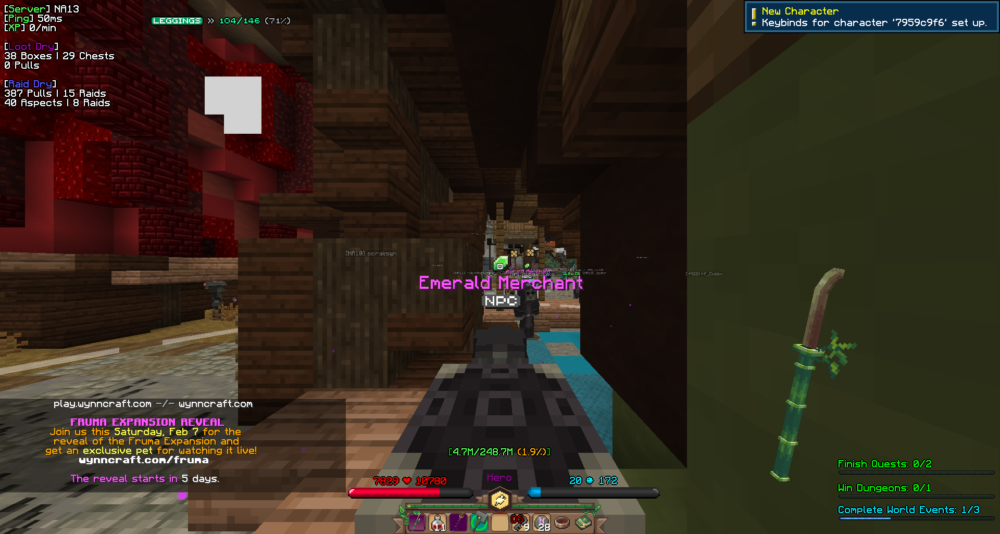
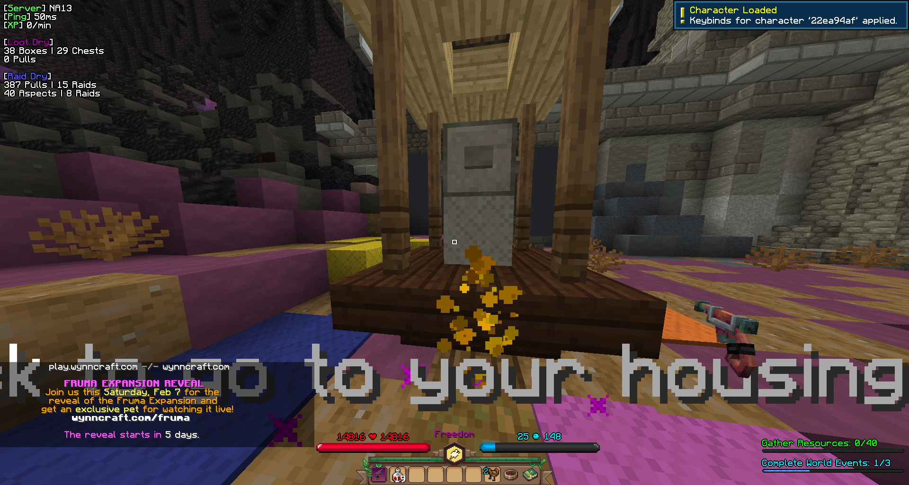
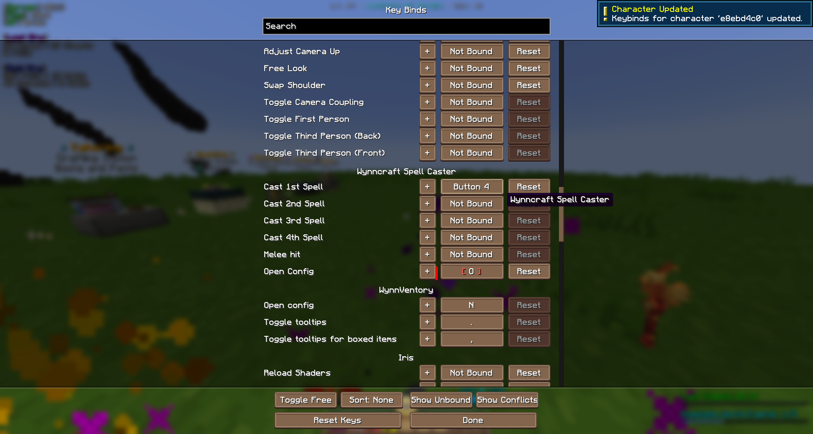
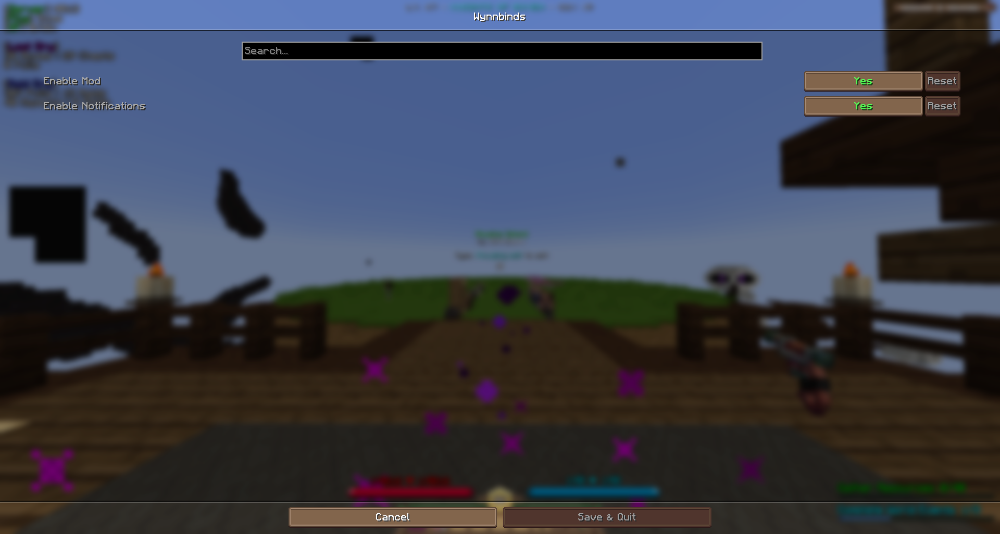

# Patch Notes
Here is a history of the project's patch notes.

## Release 1.2.0

Here's what's changed:

- Apply default keybinds for new characters
- Add source page link
- Update home page to Modrinth
- Update config menu

## Release 1.1.0

Here’s what’s included:

- Fix notifications
- Update scan keys' data structure
- Improved toast messages
- Improved log messages
- Licensing updated

## Release 1.0.0

This is the first ever release of the project! Here’s what’s included:

- The ability to enable or disable the mod itself
- The ability to enable or disable the notifications
- Handles new characters
- Handles previous characters
- Handles key bind updates

**Notification for new character**

**Notification for existing character**

**Notification for updating bind**

**Settings menu**
