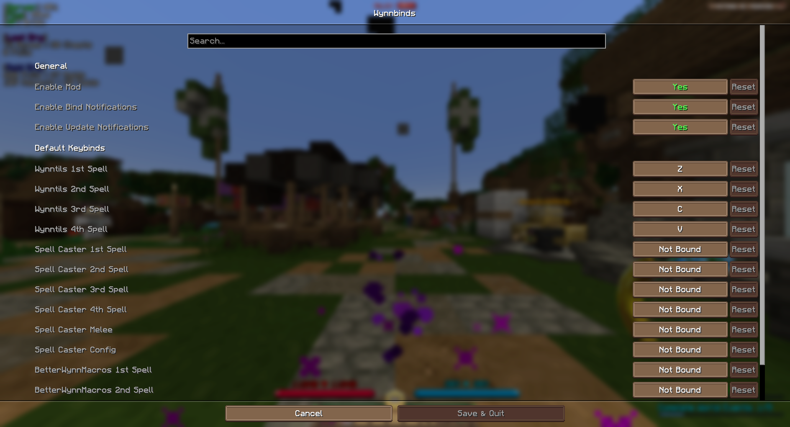

# Patch Notes
Here is a history of the project's patch notes.

## Release 1.5.0

Just some changes:

- Officially move to Minecraft version 1.21.11
- Update dependencies

## Release 1.4.0

Warning! This update will likely break your current settings. It is recommended you check and redo your settings.

Changes brought with this release:

- Ability to capture any key
- Ability to edit current binds 
- Clean up config screen for default binds
- Fully independent detection
- Remove Wynntils as dependency
- Add open config keybind

## Release 1.3.1

Just a change:

- Change log level from debug to info

## Release 1.3.0

What this release brings:

- Update checker
- Ability to set custom default binds
- Update config menu

**New settings menu**

## Release 1.2.0

Here's what's changed:

- Apply default keybinds for new characters
- Add source page link
- Update home page to Modrinth
- Update config menu
- New & improved detection

## Release 1.1.0

Here’s what’s included:

- Fix notifications
- Update scan keys' data structure
- Improved toast messages
- Improved log messages
- Licensing updated

## Release 1.0.0

This is the first ever release of the project! Here’s what’s included:

- The ability to enable or disable the mod itself
- The ability to enable or disable the notifications
- Handles new characters
- Handles previous characters
- Handles key bind updates

**Notification for new character**

**Notification for existing character**

**Notification for updating bind**

**Settings menu**
